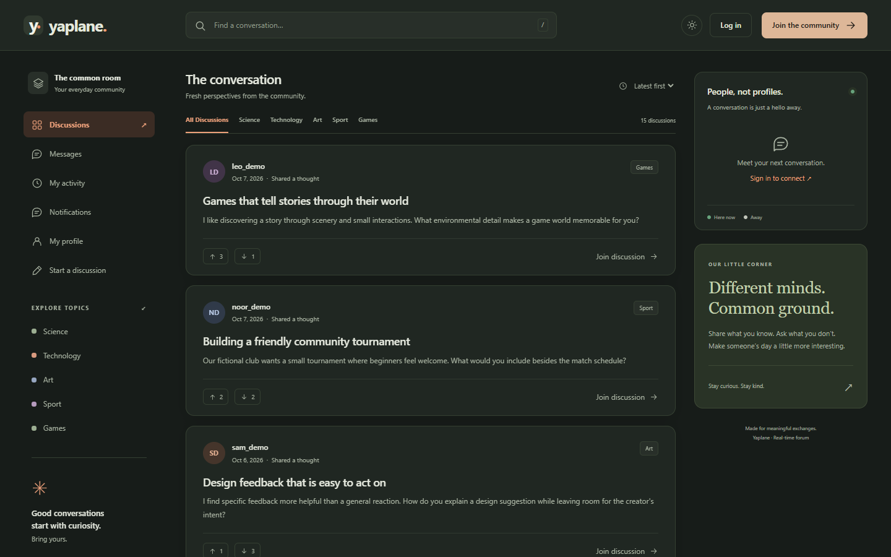

# Yaplane Live

**A real time discussion forum with private messaging, moderation, and activity notifications.** Built as a full stack portfolio project with Go, SQLite, WebSockets, and a responsive browser interface. The Go server serves the frontend and API, stores durable application data in SQLite, and pushes live updates to connected users.



*The running application in dark mode, showing the fictional demo discussions.*

## What it does

- Lets guests browse public discussions and members create posts with JPEG, PNG, or GIF attachments, write replies, and react.
- Supports private chat with message history, acknowledgments, retries, typing status, presence, multiple tabs, and reconnect handling.
- Provides local username/email login and optional Google and GitHub sign in, with required profile completion for new provider accounts.
- Separates member, moderator, and administrator permissions. Includes moderator requests, reports and replies, role and topic management, and optional review before member content is published.
- Gives each member a private activity page and notification inbox for reactions and replies.
- Supports HTTPS and WSS, bcrypt passwords, expiring server side sessions, same origin mutation checks, and bounded HTTP and WebSocket traffic.
- Validates JPEG, PNG, and GIF uploads on the server. The image limit is 20 MiB per file, in addition to multipart form data.

## Technology and design

| Area | Implementation |
| --- | --- |
| Server | Go, `net/http`, `database/sql` |
| Database | SQLite via `mattn/go-sqlite3`, WAL, pooled connections, additive migrations |
| Live features | Gorilla WebSocket with authorized private delivery, heartbeats, and reconnect resynchronization |
| Authentication | bcrypt, random UUID sessions, HttpOnly cookies, server side Google/GitHub OAuth |
| Browser UI | HTML, CSS, and native JavaScript modules; no frontend framework or build step |
| Deployment | Multi stage Docker image, non root runtime, Docker Compose, persistent data volume |

Posts, replies, reactions, messages, sessions, provider identities, moderation records, and notifications persist in SQLite. Image files are stored alongside the database storage in a dedicated uploads directory. Database migrations preserve existing records and make existing discussions visible as before. Private messages and notification events are limited to their authorized recipients.

## Run the standard app

Install Docker Desktop or Docker Engine with Compose and Go for local certificate generation. Start Docker, then follow these steps from the project root. This setup runs the standard app over HTTPS on port **8080** and lets you configure Google or GitHub sign in before building it.

**Git Bash on Windows:**

```bash
if [ ! -f .env ]; then cp .env.example .env; fi
notepad.exe .env
# Set HOST_PORT=8080 and PUBLIC_ORIGIN=https://localhost:8080.
# Set both GOOGLE_CLIENT_ID and GOOGLE_CLIENT_SECRET to enable Google.
# Set both GITHUB_CLIENT_ID and GITHUB_CLIENT_SECRET to enable GitHub.
# Leave both values empty for any unused provider. Save and close Notepad.
if [ ! -f .local/server.crt ] && [ ! -f .local/server.key ]; then go run ./cmd/certgen; fi
docker compose -f compose.yaml -f compose.https.yaml build
docker compose -f compose.yaml -f compose.https.yaml up -d --force-recreate forum
```

**PowerShell:**

```powershell
if (!(Test-Path .env)) { Copy-Item .env.example .env }
notepad.exe .env
# Set HOST_PORT=8080 and PUBLIC_ORIGIN=https://localhost:8080.
# Set both GOOGLE_CLIENT_ID and GOOGLE_CLIENT_SECRET to enable Google.
# Set both GITHUB_CLIENT_ID and GITHUB_CLIENT_SECRET to enable GitHub.
# Leave both values empty for any unused provider. Save and close Notepad.
if (!(Test-Path .local/server.crt) -and !(Test-Path .local/server.key)) { go run ./cmd/certgen }
docker compose -f compose.yaml -f compose.https.yaml build
docker compose -f compose.yaml -f compose.https.yaml up -d --force-recreate forum
```

Before continuing past the `.env` editing step, save these settings and enter the real client ID and client secret from each provider application you enable:

```dotenv
HOST_PORT=8080
PUBLIC_ORIGIN=https://localhost:8080
GOOGLE_CLIENT_ID=
GOOGLE_CLIENT_SECRET=
GITHUB_CLIENT_ID=
GITHUB_CLIENT_SECRET=
```

Register the corresponding callback URL in each enabled provider application:

```text
https://localhost:8080/auth/google/callback
https://localhost:8080/auth/github/callback
```

Clear any previously exported `HOST_PORT` or `PUBLIC_ORIGIN` shell variables, as they override `.env`. Reuse an existing `.local/server.crt` and `.local/server.key` pair; if only one exists, restore its matching file before starting HTTPS. The certificate generator refuses to overwrite existing files.

Open <https://localhost:8080> and accept the self-signed certificate warning for this local server. On the login or registration page, configured providers appear as **Continue with Google** or **Continue with GitHub**. Local account registration and login remain available without provider credentials. New provider accounts complete the forum's required profile fields.

The standard app starts without fictional demo content. Its named `forum-data` volume persists the SQLite database and uploaded images when containers restart or are recreated. After changing `.env`, apply the settings with:

```bash
docker compose -f compose.yaml -f compose.https.yaml up -d --force-recreate forum
```

Stop the service while keeping data with:

```bash
docker compose -f compose.yaml -f compose.https.yaml down
```

To run without Docker, install Go 1.27.1 and a C compiler with CGO enabled:

```sh
go run -ldflags="-s -w" .
```

Native storage defaults to `Real-Time-Forum.db` and `Real-Time-Forum-uploads/` beside it. Set `DATABASE_PATH` to use a different database. `UPLOAD_PATH` can override its corresponding attachment directory. Keep separate databases in separate upload directories.

To start the demo and try the forum yourself, follow the fictional demo setup below.

## Run the fictional demo

The demo uses its own Compose project and persistent volume, so its data stays separate from the standard app. The seeder refuses to write into an existing database. Run these commands from the project root, in order. Both setups use port **8080**, so stop the running setup before starting the other. Use that setup's `down` command below to keep its data.

**Git Bash on Windows:**

```bash
if [ ! -f .env ]; then cp .env.example .env; fi
notepad.exe .env
# In .env set HOST_PORT=8080 and PUBLIC_ORIGIN=https://localhost:8080.
# Save and close Notepad before continuing.
# Generate a certificate only if neither certificate file exists.
if [ ! -f .local/server.crt ] && [ ! -f .local/server.key ]; then go run ./cmd/certgen; fi
docker compose -p yaplane-demo -f compose.yaml -f compose.https.yaml build
# First setup only: skip seeding if the demo database already exists.
MSYS_NO_PATHCONV=1 docker compose -p yaplane-demo -f compose.yaml -f compose.https.yaml run --rm forum /app/seed-demo
docker compose -p yaplane-demo -f compose.yaml -f compose.https.yaml up -d
```

**PowerShell:**

```powershell
if (!(Test-Path .env)) { Copy-Item .env.example .env }
notepad.exe .env
# In .env set HOST_PORT=8080 and PUBLIC_ORIGIN=https://localhost:8080.
# Save and close Notepad before continuing.
# Generate a certificate only if neither certificate file exists.
if (!(Test-Path .local/server.crt) -and !(Test-Path .local/server.key)) { go run ./cmd/certgen }
docker compose -p yaplane-demo -f compose.yaml -f compose.https.yaml build
# First setup only: skip seeding if the demo database already exists.
docker compose -p yaplane-demo -f compose.yaml -f compose.https.yaml run --rm forum /app/seed-demo
docker compose -p yaplane-demo -f compose.yaml -f compose.https.yaml up -d
```

Install Go to generate the local development certificate. If both `.local/server.crt` and `.local/server.key` already exist, reuse them. If only one exists, restore the matching pair before starting HTTPS; certificate generation refuses to overwrite existing files. Clear any previously exported `HOST_PORT` or `PUBLIC_ORIGIN` shell variables, as they override `.env` values.

The `run` command seeds the project's `/data/forum.db` **before** the forum server starts. Skip it when returning to an existing demo. Git Bash can rewrite Linux-looking container paths such as `/app/seed-demo`; prefix that command with `MSYS_NO_PATHCONV=1` as shown. Run these commands from PowerShell or Git Bash; Docker Desktop still needs its configured Linux backend running. Open <https://localhost:8080> after Compose reports the service is running and accept the self-signed certificate for this local demo.

The seed includes five fictional ordinary member accounts, 15 discussions, 30 replies, 90 reactions, and 18 messages. There are no administrator accounts. The shared demo password for the five sample users is `DemoReview!2026`; treat these public demo credentials as examples only and do not use them for a private or internet facing deployment. To stop the demo and keep its seeded data, use:

```bash
docker compose -p yaplane-demo -f compose.yaml -f compose.https.yaml down
```

Use the same `-p yaplane-demo` project name when starting it again, so Compose reconnects to the same volume. No database deletion is needed to reseed; the seeder intentionally refuses an existing database.

After editing `.env`, apply the new settings to the existing demo with:

```bash
docker compose -p yaplane-demo -f compose.yaml -f compose.https.yaml up -d --force-recreate forum
```

For GitHub sign in, configure both `GITHUB_CLIENT_ID` and `GITHUB_CLIENT_SECRET` in `.env`, keep `PUBLIC_ORIGIN=https://localhost:8080`, and register `https://localhost:8080/auth/github/callback` with your GitHub OAuth app. Configured provider buttons appear on the login and registration pages.

## Optional HTTPS and WSS

The standard and demo setups above use HTTPS to support optional OAuth sign in. HTTPS is useful when you want to exercise secure cookies and TLS, and OAuth sign in requires an HTTPS origin. The frontend selects HTTP/HTTPS and WS/WSS from the page's current scheme and host, including a custom port.

To run the HTTPS Compose overlay, first create a local development certificate. The command refuses to overwrite existing certificate or key files:

```bash
go run ./cmd/certgen
```

Then set the public origin to HTTPS and start the base Compose file **together with** its HTTPS override:

```bash
export PUBLIC_ORIGIN=https://localhost:8080
docker compose -f compose.yaml -f compose.https.yaml up --build -d
```

Open <https://localhost:8080> and trust the locally generated certificate in your browser. It covers `localhost`, `127.0.0.1`, and `::1`. The HTTPS override reads `.local/server.crt` and `.local/server.key` by default; `TLS_CERT_DIR` can select a different host directory. Keep localhost in the certificate names for Docker's HTTPS health check. Public hosting requires a certificate trusted by visitors' browsers.

For **native HTTPS** instead, run the certificate command above, then configure the server in PowerShell:

```powershell
$env:PUBLIC_ORIGIN = 'https://localhost:8080'
$env:TLS_CERT_FILE = '.local/server.crt'
$env:TLS_KEY_FILE = '.local/server.key'
go run -ldflags="-s -w" .
```

`TLS_CERT_FILE` and `TLS_KEY_FILE` must both be set. The server requires TLS 1.2 or newer and uses configured HTTP timeouts. HTTPS automatically sets Secure on session cookies.

## Optional Google and GitHub sign in

The [standard app setup](#run-the-standard-app) and [fictional demo setup](#run-the-fictional-demo) both use HTTPS on port 8080 and read the same `.env`. Set `HOST_PORT=8080` and `PUBLIC_ORIGIN=https://localhost:8080`, and run one setup at a time.

Configure both credentials for each enabled provider and use an HTTPS `PUBLIC_ORIGIN`. Use your actual host and port in the provider callback if they differ from the examples. For native development, set the provider credentials and HTTPS certificate variables in the shell. Unconfigured providers stay hidden and local login remains available. Matching email addresses do not automatically combine accounts. Live provider sign in requires valid credentials configured with Google/GitHub; fixture checks are not a live sign in.

## Accounts and community roles

Create an account through the site, then promote a trusted account to administrator with local database access:

```bash
go run ./cmd/admin -email your-account@example.com
```

For Docker, target the standard Compose database:

```bash
docker compose -f compose.yaml exec forum /app/admin -email your-account@example.com
```

Git Bash users should disable path conversion for the Docker command:

```bash
MSYS_NO_PATHCONV=1 docker compose -f compose.yaml exec forum /app/admin -email your-account@example.com
```

The command promotes an existing account and does not create a shared administrator login. `ADMIN_USER_IDS` is also available for trusted existing account IDs. Set `FORUM_PREMODERATE=true` in `.env` to require staff review for member posts, replies, and edits; the default is immediate publication. Already pending items still need staff review if premoderation is later disabled.

Guests can read published discussions. Members can post, reply, react, manage their own content, and request moderator access. Moderators can review pending content, delete posts, and report discussions. Administrators can manage roles and requests, respond to reports, delete replies, and manage topics. Authors can edit their own text and topics; edits preserve authorship, creation time, and any existing image.

## Configuration

Compose reads a `.env` file in the project root. Copy [.env.example](.env.example) to `.env` to start configuring it. Native Go processes read environment variables from the shell. Restart the server after changing settings.

| Variable | Purpose |
| --- | --- |
| `PORT` | Native listening port; default `8080` |
| `HOST_PORT` | Compose host port; default `8080` |
| `DATABASE_PATH` | Native SQLite file path; Compose uses `/data/forum.db` |
| `UPLOAD_PATH` | Native image directory override; Compose uses `/data/uploads` |
| `PUBLIC_ORIGIN` | Visitor facing scheme, host, and port; needed for OAuth |
| `COOKIE_SECURE` | Enables Secure cookies in hosted deployments; direct HTTPS enables them automatically |
| `TLS_CERT_FILE`, `TLS_KEY_FILE` | Native HTTPS certificate and private key paths |
| `TLS_CERT_DIR` | Host directory mounted by the HTTPS Compose override; default `.local` |
| `GOOGLE_CLIENT_ID`, `GOOGLE_CLIENT_SECRET` | Google OAuth credentials; configure both to enable Google |
| `GITHUB_CLIENT_ID`, `GITHUB_CLIENT_SECRET` | GitHub OAuth credentials; configure both to enable GitHub |
| `FORUM_PREMODERATE` | Set `true` to review new and edited member content |
| `ADMIN_USER_IDS` | Optional comma separated IDs of existing trusted administrator accounts |
